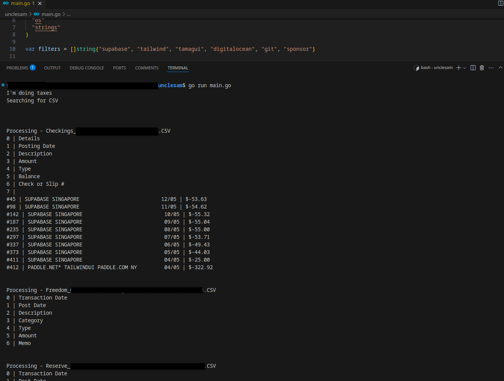
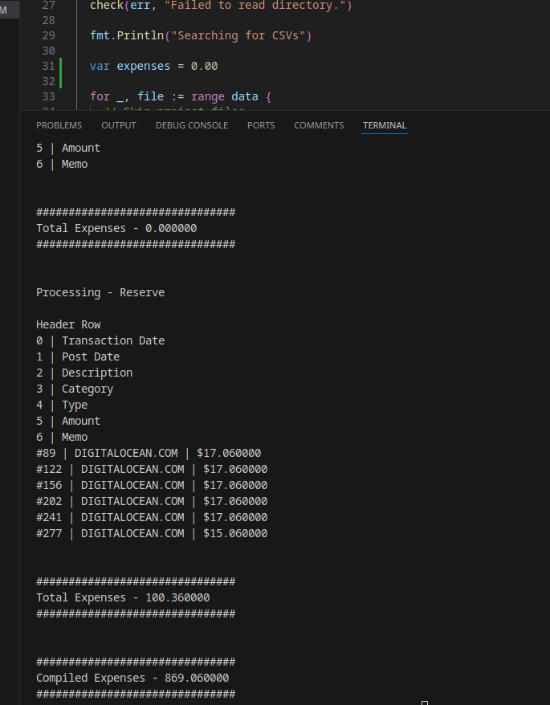

# Uncle Sam | Tax Services

So its tax season and one of the beautiful perks of getting business official is paying it up to Uncle Sam. I just wish that was me.

## Inspiration

Its a lot of work to sift through Excel Spreadsheets and I don't feel like learning macros.

Its painful. I'm fine. INSTEAD, I decided to use it as an excuse to learn some more Go. Found the [go csv package](https://pkg.go.dev/encoding/csv@go1.24.0) was baked into the standard lib (like most things), downloaded my transactions across a couple of cards and accounts, and got to work.

## Gameplan

### Collect files

I exported my transactions to CSVs and dropped them in the root of the project. If you fork...obviously don't commit your financial transactions.

### Find out which columns we need

Thankfully my bank provides standardized CSVs but I made it dynamic bc why not.
Added a function to parse the header and return which columns contain the transaction's `description` and `amount`.

### Filter out transactions I need

Unfortunately DoorDash effectively owns my transactions so I need to filter down to just transactions I need.

Something'll probably slip through the cracks but luckily I know must of them.

### Compile results

Just a string conversion to float and adding. If I wanted to do some calculations or find some aggregations then I could add that but thankfully I just need income and expenses.

Not a bad idea though, we'll do that later because I never wanna touch this again and don't feel like signing up to QuickBooks.

### Sip some tea and touch some grass

I already feel like I spent too much time on this but I've got 12 days to get this filed and whip up a K-1 form soooo I continue to cook.

## Changelog

So I'm writing this from the point where I've got file reading kinda working.

### Filtering is working

Got filtering working

Got expenses generated. Looking good

